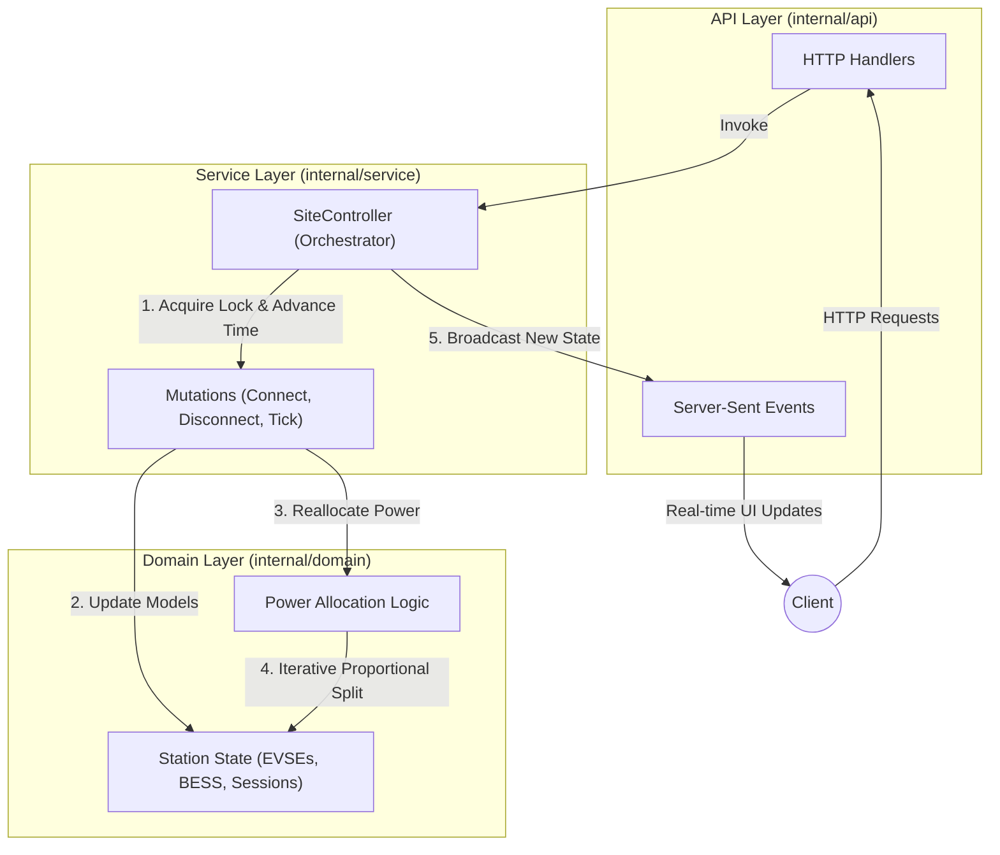
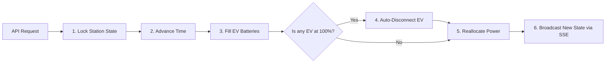
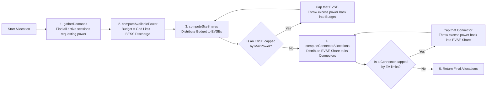

# SEMS - Smart Energy Management System

SEMS is an in-memory, deterministic simulation engine for managing EV charging stations with Battery Energy Storage Systems (BESS). It dynamically allocates power to connected EVs using a two-level proportional distribution algorithm while enforcing hardware limits, requested power constraints, and grid limits.

## Architecture

*   **Hexagonal Architecture:** The codebase is organized into domain, service, and API layers to keep core business logic pure and decoupled from infrastructure.
*   **Two-Level Proportional Allocation:** Power is proportionally split first among active EVSEs (based on total connector demand), and then proportionally among the active connectors within each EVSE, capped at limits.
*   **BESS Integration:** Integrates a battery that charges on spare grid power and discharges to boost available power during high demand, while strictly enforcing a 10% SoC floor.
*   **Time Simulation:** Time is advanced synthetically via a `Tick` API to update SoC and automatically disconnect fully charged vehicles in a deterministic manner.

## Getting Started

### Prerequisites
- Go 1.23 or higher
### Run via Docker (Recommended)

This approach ensures the application works identically on all computers without needing to install Go.

```bash
# Run all tests inside a Docker container
make test

# Build and run the entire stack (with live logs attached)
make build
```


## API Documentation

Swagger UI is available at `http://localhost:8080/swagger/`.
The raw OpenAPI 3.0 specification can be found in `swagger/openapi.yaml`.

### Domain Logic & Architecture Schema

The codebase is strictly separated into three layers to ensure thread-safety, determinism, and pure business logic.



#### Layer Breakdown:

1. **Domain Layer (`internal/domain`)**
   - **Responsibility:** Pure business logic. Completely unaware of concurrency (no mutexes), HTTP requests, or external databases.
   - **Key Components:**
     - `Station`, `EVSE`, `Connector`, `BESS`, `Session`: The core data models representing the physical hardware and active charging sessions.
     - `allocation.go`: Contains the `Allocate()` function and the `proportionalSplitWithLimits` algorithm. It gathers the active power demands from all connected EVs, factors in the `GridLimit` and BESS capabilities, and computes exactly how much power each `Connector` receives. It ensures no EVSE or vehicle exceeds its physical constraints and redistributes excess power intelligently.

2. **Service Layer (`internal/service`)**
   - **Responsibility:** Thread-safe orchestration and state management.
   - **Key Components:**
     - `SiteController`: The central brain of the application. It holds the root `domain.Station` model and a `sync.RWMutex` to prevent race conditions.
     - **Mutations:** Functions like `ConnectEV()`, `DisconnectEV()`, and `Tick()`. They lock the state, apply the changes to the domain models, call the domain's reallocation algorithm to recalculate power distributions, and then fire a broadcast event.
     - **Time Simulation:** Manages the deterministic `lastTimestamp` with strict monotonic enforcement (preventing "time travel" via API). When `Tick()` is called, it simulates the passage of time (capped at 10-minute intervals to protect physics calculations), fills up the EV batteries based on their allocated power, and automatically disconnects vehicles that reach 100% SoC.

3. **API Layer (`internal/api`)**
   - **Responsibility:** Translating HTTP requests into Service Layer commands and formatting the output.
   - **Key Components:**
     - `Server` & `Handlers`: Handles parsing JSON requests, validating payload integrity (DTO validation), returning HTTP status codes, and serving the Swagger UI and Web Dashboard. The `/config` endpoint also allows for live hot-swapping of the entire station hardware without downtime.
     - **SSE Streaming**: Maintains an open connection (`http.Flusher`) to connected web clients. When the `SiteController` broadcasts a state change, the API layer immediately flushes the new JSON representation to the browser for true real-time updates.

### Deep Dive: Core Algorithms & Sequence

To understand the core logic of the simulation, we must look at how time and power are processed. The system relies on two main "hard functions": `Tick()` (the time engine) and `Allocate()` (the power distributor).

#### 1. The Time Engine: `SiteController.Tick(duration)`
Because the simulation does not use real-time `time.Now()`, the station's state only advances when `Tick()` is called. This is the heartbeat of the system.



**Step-by-step breakdown (Easy to explain):**
1. **Lock State:** Pause any other incoming requests to prevent data conflicts.
2. **Advance Time:** Move the simulation clock forward (e.g., +1 minute).
3. **Fill Batteries:** Add energy (kWh) to every connected car based on how much power they were allocated in the previous minute.
4. **Auto-Disconnect:** If a car reaches 100% battery, unplug it automatically.
5. **Reallocate Power:** Because cars might have left, or their charging curves changed, we run the Allocation algorithm to perfectly balance the power again.
6. **Broadcast:** Send the brand new state instantly to the web dashboard so users see the update in real-time.

#### 2. The Power Distributor: `domain.Allocate(station)`
The hardest algorithmic challenge is distributing a limited power budget fairly when hardware constraints (like a 300kW cable limit) cap what an individual vehicle can receive. 

Instead of a simple division (which wastes power when a vehicle hits its cap), the system uses an **Iterative Proportional Split with Limits** (`proportionalSplitWithLimits`).



**How `proportionalSplitWithLimits` Works (The Loop):**
1. **Calculate Fair Share:** Divide the remaining budget proportionally based on each participant's requested demand.
2. **Apply Constraints:** Check if any participant's fair share exceeds their physical limit.
3. **Cap & Harvest:** If they exceed the limit, lock them at their maximum limit, subtract that from the budget, and remove them from the active pool.
4. **Redistribute:** Take the excess power they couldn't use and loop back to step 1, redistributing the leftover budget among the *remaining* participants.
5. **Terminate:** The loop ends when no participant hits a limit, ensuring 100% of available power is utilized without violating hardware constraints.

## Design Constraints
- **Pure logic**: No external DB or real-time `time.Now()` is used in the simulation logic.
- **Strict Validation**: All API DTOs and configuration payloads are validated before reaching the Service layer to prevent panics on malformed data.
- **Monotonic Time**: Time advancement is strictly monotonic, preventing backwards time travel via API requests.
- **Tick Cap**: Time leaps are capped at 10 minutes max to prevent mathematical bypasses of hardware constraints (e.g., BESS operational floors).
- **Concurrency**: Lock-free domain layer with concurrency handled at the orchestration (`SiteController`) layer.
