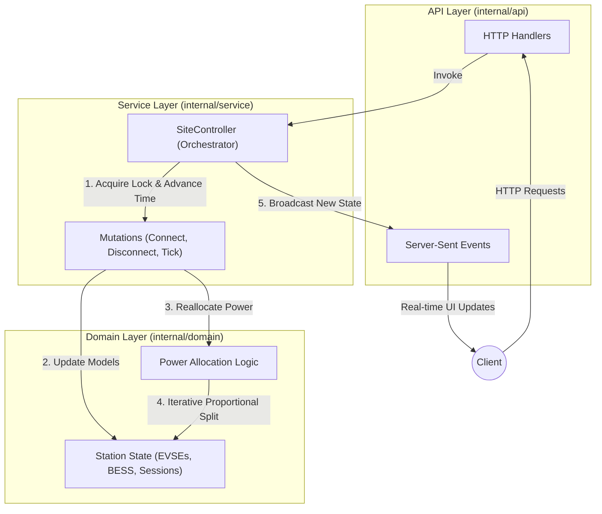

# SEMS - Smart Energy Management System

SEMS is an in-memory, deterministic simulation engine for managing EV charging stations with Battery Energy Storage Systems (BESS). It dynamically allocates power to connected EVs using a two-level proportional distribution algorithm while enforcing hardware limits, requested power constraints, and grid limits.

## Architecture

*   **Hexagonal Architecture:** The codebase is organized into domain, service, and API layers to keep core business logic pure and decoupled from infrastructure.
*   **Two-Level Proportional Allocation:** Power is proportionally split first among active EVSEs (based on total connector demand), and then proportionally among the active connectors within each EVSE, capped at limits.
*   **BESS Integration:** Integrates a battery that charges on spare grid power and discharges to boost available power during high demand, while strictly enforcing a 10% SoC floor.
*   **Time Simulation:** Time is advanced synthetically via a `Tick` API to update SoC and automatically disconnect fully charged vehicles in a deterministic manner.

## Getting Started

### Prerequisites
- Go 1.23 or higher
### Run via Docker (Recommended)

This approach ensures the application works identically on all computers without needing to install Go.

```bash
# Run all tests inside a Docker container
make test

# Build and run the entire stack (with live logs attached)
make build
```


## API Documentation

Swagger UI is available at `http://localhost:8080/swagger/`.
The raw OpenAPI 3.0 specification can be found in `swagger/openapi.yaml`.

### Domain Logic & Architecture Schema

The codebase is strictly separated into three layers to ensure thread-safety, determinism, and pure business logic.



#### Layer Breakdown:

1. **Domain Layer (`internal/domain`)**
   - **Responsibility:** Pure business logic. Completely unaware of concurrency (no mutexes), HTTP requests, or external databases.
   - **Key Components:**
     - `Station`, `EVSE`, `Connector`, `BESS`, `Session`: The core data models representing the physical hardware and active charging sessions.
     - `allocation.go`: Contains the `Allocate()` function and the `proportionalSplitWithLimits` algorithm. It gathers the active power demands from all connected EVs, factors in the `GridLimit` and BESS capabilities, and computes exactly how much power each `Connector` receives. It ensures no EVSE or vehicle exceeds its physical constraints and redistributes excess power intelligently.

2. **Service Layer (`internal/service`)**
   - **Responsibility:** Thread-safe orchestration and state management.
   - **Key Components:**
     - `SiteController`: The central brain of the application. It holds the root `domain.Station` model and a `sync.RWMutex` to prevent race conditions.
     - **Mutations:** Functions like `ConnectEV()`, `DisconnectEV()`, and `Tick()`. They lock the state, apply the changes to the domain models, call the domain's reallocation algorithm to recalculate power distributions, and then fire a broadcast event.
     - **Time Simulation:** Manages the deterministic `lastTimestamp`. When `Tick()` is called, it simulates the passage of time, fills up the EV batteries based on their allocated power, and automatically disconnects vehicles that reach 100% SoC.

3. **API Layer (`internal/api`)**
   - **Responsibility:** Translating HTTP requests into Service Layer commands and formatting the output.
   - **Key Components:**
     - `Server` & `Handlers`: Handles parsing JSON requests, returning HTTP status codes, and serving the Swagger UI and Web Dashboard.
     - **SSE Streaming**: Maintains an open connection (`http.Flusher`) to connected web clients. When the `SiteController` broadcasts a state change, the API layer immediately flushes the new JSON representation to the browser for true real-time updates.

## Design Constraints
- Pure logic: no external DB or real-time `time.Now()` is used in the simulation logic.
- 2-digit precision for SoC display formats.
- Lock-free domain layer with concurrency handled at the orchestration (`SiteController`) layer.
